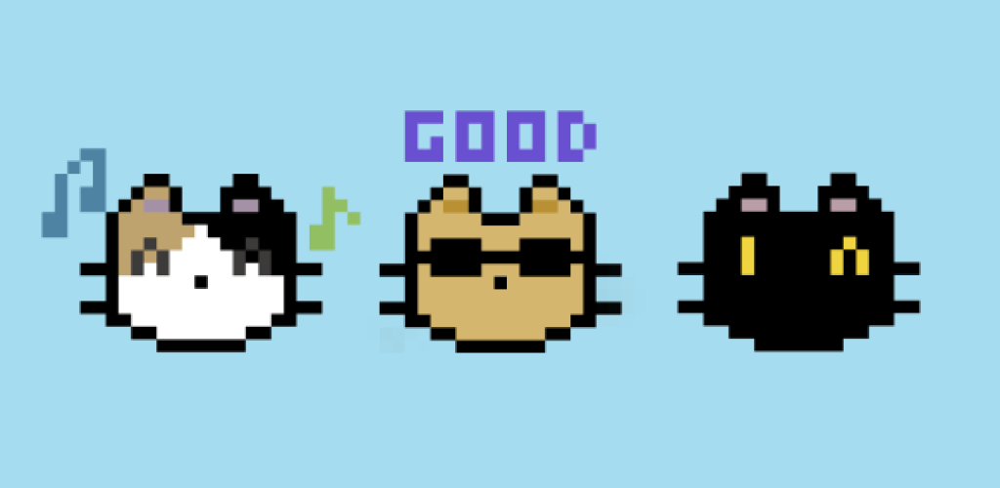
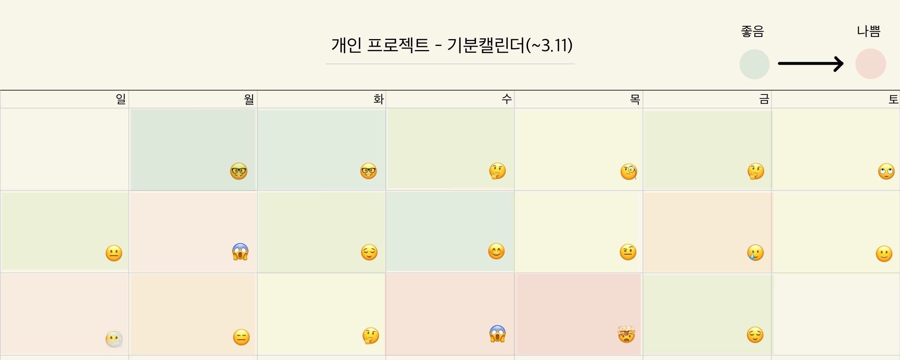
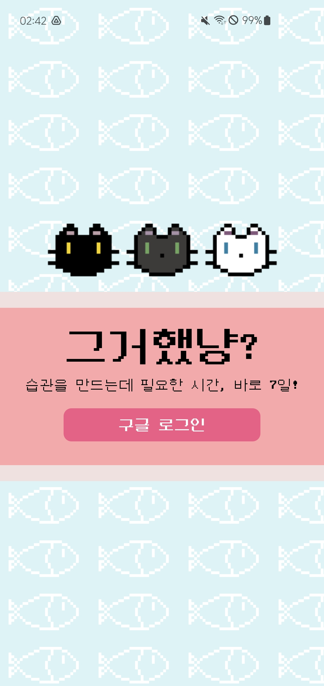
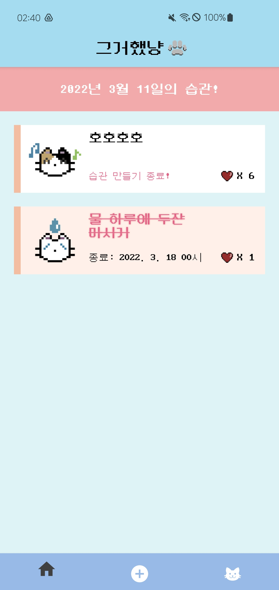
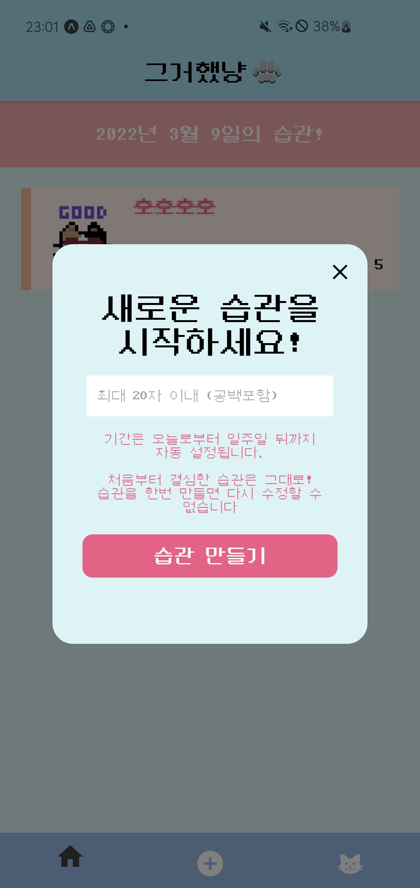
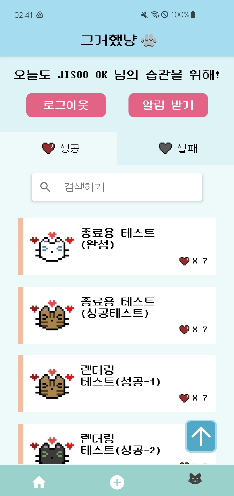
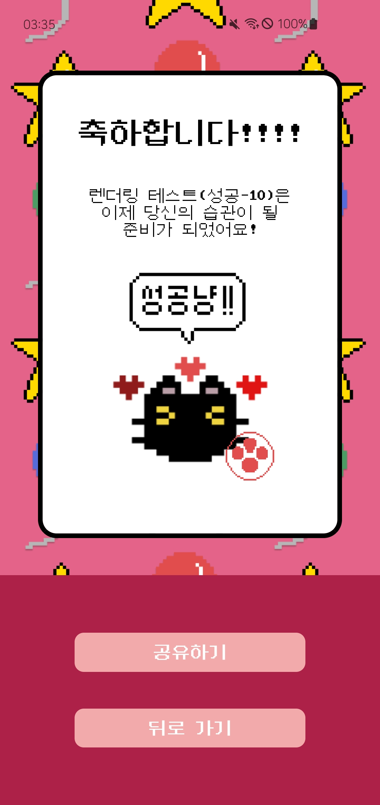
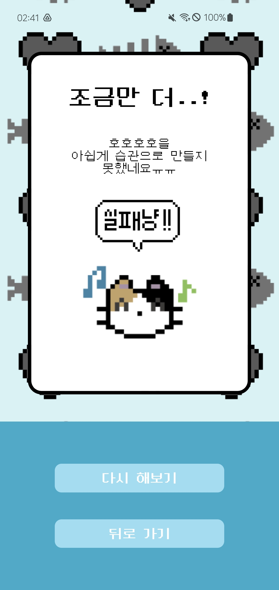

# **🐱 그거했냥**

<p align="center">

</p>

마음속으로만 생각한 습관을 1주일만이라도 지켜낸다면 이미 이 습관은 당신의 것!<br>
"그거했냥?"으로 습관 만들기를 시작해보세요!
<br>
<br>

# **📱 목차**
1. [사용 영상](#-사용-영상)
2. [동기](#-동기)
3. [프로젝트 기간](#-프로젝트-기간)
4. [프로젝트 기간 동안의 고민 일기](#-프로젝트-기간동안의-고민-일기)
5. [기술 스택](#-기술-스택)
6. [실행 방법](#-실행-방법)
7. [환경변수 설정 부분](#-환경변수-설정-부분)
8. [기능](#-기능)
9. [기술스택 사용 소감](#-기술스택-사용-소감)
10. [소감](#-소감)
<br>
<br>

# **📽 사용 영상**

[apk 파일 다운로드](https://exp-shell-app-assets.s3.us-west-1.amazonaws.com/android/%40jisoook/didyoudothat-619bae42e9144aafac01b13f926755f5-signed.apk)
<br>

<p>


</p>

<br>
<br>

# **💡 동기**
**습관 만들기를 희망하지만 실행하는게 거의 없는 J같지 않은 J인 나를 위해**<br>
- “오늘은 꼭 일찍 일어나서 운동가야지”, “오늘은 물 800ml 정도는 꼭 마셔야지”
제가 제일 마음속으로 많이 되뇌이던 결심들이었습니다. 하지만, 생각만 하는 것으로는 잘 지켜지지 않았던 제 경험을 되살려서, 사소한 습관이라도 꾸준히 지키게 해줄 수 있는 마음가짐을 만들어 줄 수 있는 Habit Tracker 어플을 만들어보고 싶었습니다.<br><br>
- “시작이 반이다”라는 말처럼, 일주일의 시간동안이라도 꾸준하게 본인이 만들어보고 싶었던 습관을 재미있게 만들어볼 수 있게 하고 싶었고, (비록 저만 없지만..) 제가 좋아하는 고양이의 상태를 변화시키는 재미를 느껴보았으면 좋겠습니다.
<br>
<br>

# **🗓 프로젝트 기간**
**1주차 (02.21 ~ 02.26) - 준비**

- 아이디어 기획 및 기술스택 선정 및 검토
- 목업, 스키마, 태스크 카드 작성
  - [목업](https://jsok79.notion.site/mockup-560130c1d65a4df5b129d3a1a27511cd)
  - [스키마](https://jsok79.notion.site/schema-fcd52c73f5f14f61b700d0a671fd91cb)
  - [KANBAN](https://jsok79.notion.site/33c35c40538b40b8a4f3c620316b4fd4?v=9f7eab84b0104769824b6b70f34ec8ea)
- git repository 생성 및 초기 폴더구조 셋팅

**2주차 (02.27 ~ 03.05) - 개발**

- 로그인 화면 및 관련 백엔드 작업
- 메인화면, 습관 종료된 화면 렌더링 및 관련 백엔드 작업

**3주차 (03.06 ~ 03.11) - 개발 및 마무리**

- 마이페이지 화면 렌더링 및 백엔드 작업
- 리팩토링
- 배포 및 테스트 코드 작성
<br>
<br>

# **🌤 프로젝트 기간동안의 고민 일기**


- **2월 21일 ~ 23일 (1주차 월 ~ 수요일) : 프로젝트 기획 및 asset에 대한 고민**
    - 개인 프로젝트에 대해 처음으로 기획하게 되었을 때, 제가 생각했던 것보다 조금 더 기능이 많거나 css 적으로 더 다양한 것을 구현해보고 싶다는 생각을 하게 되었습니다. 해보고 싶었던 것을 프로젝트로 만들다 보니 조금 더 애정이 가게 되었고, 제가 원하는 컨셉에 맞는 어플리케이션을 만들고 싶어서 시간이 다소 걸리더라도, 사용되는 이미지들을 제가 직접 그려 구현하기로 하였습니다.<br><br>
 - **2월 24일 (1주차 목요일) : 전역상태 관리에 대한 고민**
    - 유저 정보의 관리를 위해 전역상태가 필요했습니다. 처음에는 막연하게 가볍게라도 전역상태관리 라이브러리를 사용해야겠다고 생각했으나, 유저 정보를 위해 굳이 라이브러리를 사용하지 않아도 될 것 같아, useContext로 전역상태관리를 하기로 하였습니다. useContext에 저장된 유저 정보는 로그인과 로그아웃, 이 두 경우에만 변하기 때문에 큰 용량의 전역상태 관리 툴을 사용하지 않아도 될 것이라 판단하였습니다.<br><br>
 - **2월 26일 (1주차 토요일) : useQuery 에러 처리에 대한 고민**
    - useQuery처리 에러 발생 이후 어떻게 처리해주어야 할지에 대해 고민했었는데 첫번째로 고민했던 부분은 에러 컴포넌트를 만들고 그 내부에 뒤로가기 버튼 혹은 try again버튼을 만들어서 다시 query를 불러오고자 하였습니다. 하지만, suspense와  관련된 작업과 fallbackRender에 들어가야하는 컴포넌트를 그려주었으나 계속해서 에러가 났기 때문에 우선은 안드로이드에서 구현 가능한 Toast 알람으로 에러와 관련된 처리를 해주었습니다. 그러면 에러가 발생했을때 토스트 알람으로 받을 수 있고, 다시 query를 시도해볼 수 있게 됩니다. suspense가 아직은 실험적인 단계이기 때문에, useQuery의 isLoading 및 isError, useMutation의 onError 등을 사용하는 것으로 결정하였습니다.<br><br>
 - **3월 4일 (2주차 금요일) : 시간 데이터 저장에 대한 고민**
    - 서버에는 ISO에 맞게 저장을 하는데 클라이언트로 불러올 때 로컬시간에 맞게 분기처리를 어떻게 해야 할지 고민이 되었습니다. 그래서 우선은 서버에 저장되는 데이터는 ISO 기준으로 저장해주고, 화면에서 종료시점에 대한 분기처리를 해줄때, getTimeOffsetZone 메소드를 기준으로 UTC와 로컬 사이의 시간차를 바탕으로 UTC와 로컬타임의 일자를 계산하여 정리하기로 하였습니다. 최대한 라이브러리를 사용하지 않고 구현해보고자 코드가 정돈되지 않았는데, 이 외에도 조금 더 깔끔하게 time zone 코딩에 대해 정리할 수 있는 방법에 대해 생각해봐야 할 것 같습니다.<br><br>
 - **3월 10일 ~ 11일 (3주차 수 ~ 목요일) : 배포에 대한 고민**
    - expo start, expo publish, expo start --no-dev로 실행하였을 때에도 발생하지 않았던 로그인 에러가 발생하였습니다. apk 파일을 통해 직접 설치 후 진행했을 때, 구글 로그인으로 들어갈 수 있었으나, 구글 계정 선택후 다시 로그인 화면이 렌더링 되는 것이 반복되었습니다. 아무리 찾아도 원인에 대해서 파악할 수 없어서 공식문서 및 stackoverflow를 뒤져보았고, 공식문서에 적혀있던 provider/google 내 메소드 명이 잘못 되었고, 다른 메소드를 사용하여야 한다는 것을 발견하였습니다. 또한, expo 사이트 내 환경변수 지정 및 eas cli 설치 등 다양한 접근 방식을 통해 성공적으로 build할 수 있었습니다. 공식문서가 중요한 기준점이 되긴 하지만, 모르는 부분이 있을 때는 다양한 검색 및 접근을 통해 해결해야 한다는 것을 알 수 있었습니다.
<br>
<br>

# **🔨 기술 스택**
## **프론트엔드**
- React Native
- React Query 
- Expo-cli
- Emotion

## **백엔드**
- Node.js
- Express
- MongoDB
- Google Oauth 2.0
- JWT
- Elastic Beanstalk(배포)

## **테스트**
- jest
- enzyme
<br>
<br>

# **📝 실행 방법**
## **Client**
client를 기기에서 실행하기 위해서, 서버가 사용하는 와이파이와 기기가 사용하는 와이파이가 동일해야 합니다.

```
git clone https://github.com/didYouDoThat/didYouDoThat-Client.git
npm install 
npm start // expo start
```
<br>

## **Server**
```
git clone https://github.com/didYouDoThat/didYouDoThat-Server.git
npm install
npm start // npm run dev (development 버전)
```
<br>
<br>

# **🔐 환경변수 설정 부분**

### **Client 폴더 최상단에 .env 파일을 생성한 후 아래의 정보를 넣어주세요**

```
SERVER_URI=http://<YOUR_WIFI_IP_ADDRESS>:8000/
GOOGLE_EXPO_CLIENT_ID=<YOUR_GOOGLE_CLOUD_CREDENTIAL_KEY_OF_WEB_APP>
GOOGLE_IOS_CLIENT_ID=<YOUR_GOOGLE_CLOUD_CREDENTIAL_KEY_OF_IOS>
GOOGLE_ANDROID_CLIENT_ID=<YOUR_GOOGLE_CLOUD_CREDENTIAL_KEY_OF_ANDROID>
```
<br>

### **Server 폴더 최상단에 .env 파일을 생성한 후 아래의 정보를 넣어주세요**
```
MONGO_DB_URI=<YOUR_MONGO_DB_URI>
GOOGLE_CLIENT_ID=<YOUR_GOOGLE_CLOUD_CREDENTIAL_KEY_OF_WEB_APP>
SECRET_KEY=<YOUR_JWT_TOKEN_SECRET_KEY>
```
<br>
<br>

# **🔬 기능**

## **로그인 화면**


- 구글 로그인을 통해 로그인 한 회원만 어플을 사용할 수 있습니다.
- 로그인을 한 후 로그아웃을 하지 않는다면, 해당 앱을 강제 종료시키더라도 로그인이 유지됩니다.

<br>

## **메인 화면**


- 하단 탭 메뉴에서는 메인 화면으로 올 수 있는 메인버튼, 새로운 습관을 만들 수 있는 버튼, 그리고 마이페이지로 갈 수 있는 버튼 총 3가지로 구성되어있습니다. (맨 처음 나타나는 화면은 메인 버튼 클릭시 나오는 메인 화면입니다)
- 현재 일자를 표시해주는 날짜 영역이 있습니다.
- 현재 일자를 기준으로 진행하고 있는 습관 리스트들 혹은 어제 일자 기준으로 종료된 습관들이 나타납니다.
- 매 습관은 매일 00시 기준으로 업데이트가 되며, 전날 습관을 시행했다고 표시한 것들도 모두 리셋됩니다.
- 아직 종료되지 않은 습관들을 클릭하면(진행했다는 표시) 해당 습관의 제목영역에 빨간 줄이 그어지며, 하단의 하트 개수가 1 증가하고, 이에 따라 해당 습관의 고양이이미지가 변합니다.
- 반대로 이미 진행했다고 표시한, 종료되지 않은 습관들을 클릭하면 해당 습관이 시행되지 않은 상태로 다시 돌아오게 됩니다.
- 종료된 습관을 클릭하게 되면, 습관에 대한 결과페이지로 이동하게 됩니다.

<br>

## **새로운 습관 생성 화면**


- 하단 탭 메뉴의 새로운 습관을 생성하는 버튼을 누르게 되면, 새로운 습관을 만드는 모달이 나타납니다.
- 모달을 통해 습관의 제목을 지정할 수 있으며 최대 20자까지 지정 가능합니다.
- 새로운 습관을 만드는 버튼을 누르게 되면, 해당 습관에 해당하는 고양이가 배정되며, 마감기한은 자동으로 일주일 뒤로 생성되고, 메인 화면으로 돌아가는 버튼을 통해 해당 페이지를 빠져나오게 됩니다.
- 활성화된 습관이 5개인 경우, 추가적인 습관은 생성할 수 없게 됩니다.

<br>

## **마이페이지**


- 현재 로그인된 유저의 구글 계정 내 user 이름이 노출됩니다.
- 로그아웃 버튼, 그리고 매일 10시 주기적으로 알람을 받을 수 있는 알람 받기 버튼이 있습니다.
    - 알람 받기 버튼을 누르게 되면 모달창을 통해 최종적으로 알람을 받을 수 있는지에 대한 여부를 확인하며, 알림을 받은 상태의 유저라면, 알람 받기 버튼은 알람 받지 않기 버튼으로 바뀌게 됩니다.
    - 알람을 받은 후 알람 끄기를 희망하는 경우, 마이페이지 내 알람 받지 않기 버튼을 클릭하여 동일한 과정으로 해제할 수 있습니다.
- 현재까지 만든 습관들 중 종료된 습관들만 따로 볼 수 있는 영역이 있습니다.
    - 종료된 습관들이 없다면, 빈 화면 내 대체 이미지와 텍스트가 나타납니다.
    - 종료된 습관들은 성공한 습관들 (일주일 동안 모두 실행 했던 습관)과 실패한 습관들 (일주일동안 하루라도 시행하지 않았던 습관들)을 따로 모아둔 성공탭, 실패탭으로 구분되어집니다.
    - 각 탭별로 5개씩 렌더링되며, 5개보다 더 많은 습관들이 있는 경우, 무한스크롤로 인해 계속해서 확인할 수 있습니다.
    - 각 탭별 내에는 검색창이 있고, 검색창을 통해 종료된 습관들의 습관 제목을 기준으로 검색할 수 있습니다.
    - 각 종료된 습관들을 클릭하게 되면, 습관에 대한 결과페이지로 이동하게 됩니다.

<br>

## **결과 페이지**
<p>


</p>

- 결과 페이지는 각 습관들의 이행정도를 나타내주는 페이지 입니다.
- 성공 결과페이지는 결과내용과 함께 캡쳐하기 버튼, 돌아가기 버튼이 나타납니다.
    - 캡쳐하기 버튼을 통해 결과페이지를 캡쳐할 수 있으며, 이를 SNS에 공유할 수 있습니다.
- 실패 결과페이지는 결과내용과 함께 다시 만들기 버튼, 돌아가기 버튼이 나타납니다.
    - 다시 만들기 버튼을 통해 해당 습관의 동일한 제목을 기반으로 새로운 습관을 다시 시작할 수 있습니다.
<br>
<br>

# **🗂 기술스택 사용 소감**

## React-Native
이 프로젝트를 시작하기 전까지 웹 어플리케이션만 구현해보았고, 막연하게 모바일 어플리케이션을 만들기 위해 사용해야 겠다는 생각을 하였습니다. 하지만, 실제 사용하면서 느꼈던 점은 리액트와 비슷하지만 비슷하지 않은 부분들이 많았다는 점입니다. 

### 1. navigation
react에서는 route를 기반으로 이동하지만, react-native에서는 screen별 이동을 하기 위해, navigation을 이용해야 하는 점이 새롭게 다가왔습니다. screen을 통해서 이동 후 다시 돌아오게 되더라도 unmount 되었다고 판단되지 않는 점이 메인페이지 로 이동할 때마다 시간에 맞춰 데이터를 보여줘야 하는 어플 기능에 영향을 주게 되었습니다. 이를 위해 focus 이벤트로 navigation이 될때 마다 다시 데이터 refetch를 하게 하였습니다. 이 기본 원리가 웹 react와는 가장 달랐고, prop을 전달해주는 방식도 많이 달랐다는 것을 느꼈던 부분이었습니다. 

### 2. style
모바일의 style을 다루는 방법이 기존에 웹에서 사용하던 방식과 많이 달라, 초반 css를 구현하는데 어려움을 겪었습니다. 각 screen별로 status bar에 대한 설정을 하거나 stack navigator, stack group 등 각각의 그룹별로도 다양하게 설정을 할 수 있다는 점이 오히려 자율성을 주는 대신 더 설정해야 하고 분기처리해야 하는 부분들이 많았다고 느껴졌습니다. 또한, 웹에서는 익숙했던 css 문법이 많이 달라, 이를 위해 emotion을 도입하게 되었습니다. styled-component와 거의 유사한 emotion을 도입하게 된 이유는, 기존에 웹에서 많이 사용했던 styled-component와 문법이 거의 유사했고, 조금 더 가벼운 라이브러리였기 때문에 이번 프로젝트에 더 적합하다고 생각했기 때문입니다. 하지만 프론트엔드 테스트 코드 작성 시, 해당 태그를 찾을때 각 컴포넌트의 style.js 파일에서 import 해와야 테스트가 가능했다는 점이 다소 아쉬웠습니다.<br>
<br>
## React-Query
해당 라이브러리를 도입하게된 계기는 지난 팀프로젝트 당시, redux와 redux-toolkit(createSlice, redux-Saga)를 통해 비동기 처리를 진행하였었습니다. socket.io를 saga의 event-channel로 다룰 수 있어 비동기처리를 자율적으로 처리하기 편했으나, 생각보다 boiler plate가 많았고, action 함수가 너무 많아져 가독성이 많이 떨어지게 된 점이 아쉬웠습니다. 그래서 이번 프로젝트에 boiler plate가 적고, 전역으로 데이터를 관리할 수 있는 react-query 도입을 결정하게 되었습니다. 무엇보다, 모바일에서 필요한 pagination을 잘 처리할 수 있는 useInfiniteQuery가 있었고, 각 hook 별로 비동기처리에 대한 과정에 대해 가독성 좋게 짧은 양의 코드로도 구현이 가능할 것이라 생각했기 때문에 더더욱 선택하게 되었습니다.<br>
하지만, 처음 접해보는 비동기 처리 로직으로 로그인 방식 및 react-query로도 관리가 어려웠던 user 정보 전역관리에 대한 고민을 하느라 초반에 방향을 잡는데 어려웠고, 관련 사용법에 대해서 정말 자세하게 익히지 못한 것이 다소 아쉬웠습니다. 이번에 사용한 경험을 통해 다음 사이드 프로젝트 혹은 현업에서 다루게 될 때, react-query의 문법들을 다양하고, 효율적으로 진행해보고 싶습니다.
<br>
<br>

# **🎤 소감**
이번 프로젝트를 통해 제가 전에 시도해보지 못했던 새로운 것들을 많이 해볼 수 있었습니다. 리액트 네이티브로 프론트엔드 작업을 하면서 처음 보는 부분들이 많았고 코드가 완벽하지는 않지만, 그만큼 배우는 과정에 있어서 흥미를 느꼈던 것 같습니다. 하나하나 책도 보고, 유튜브도 보고, 공식문서를 많이 보면서 풀리지 않았던 부분들을 해결해나가는 과정이 개인적으로 좋은 경험이었고, 프로젝트를 진행하는 원동력이 되었습니다. 앞으로도 이 감각을 계속 유지하여 더 많이 배우고, 더 성장할 수 있는 개발자가 되고 싶습니다.
<br>
<br>
